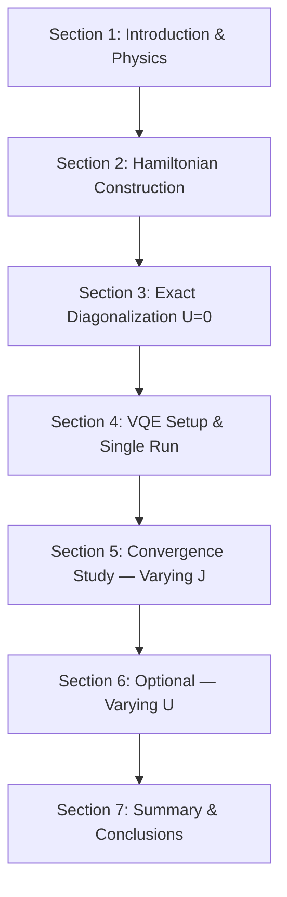

# Design Document: Fermi-Hubbard VQE

## Overview

This design describes a Jupyter notebook (`fermi_hubbard_vqe.ipynb`) that simulates the 3-site Fermi-Hubbard model using the Variational Quantum Eigensolver (VQE) algorithm via Qiskit. The notebook is structured for presentation, covering Hamiltonian construction, exact diagonalization, VQE optimization, and convergence studies over the hopping parameter J (and optionally the on-site interaction U).

The Fermi-Hubbard model maps to a 6-qubit system (2 qubits per site: one for spin-up, one for spin-down). The Hamiltonian is expressed as a `SparsePauliOp` and the ground state energy is found both exactly (via `numpy.linalg.eigvalsh`) and variationally (via VQE with `StatevectorEstimator`).

---

## Architecture

The notebook is organized as a linear sequence of cells grouped into logical sections. There is no separate module or package — all logic lives in the notebook itself, consistent with the existing workspace style.



Each section contains:
- One or more markdown cells explaining the physics/algorithm
- Code cells implementing the logic
- Output cells showing results or plots

---

## Components and Interfaces

### 1. Hamiltonian Builder

**Function:** `build_hamiltonian(J: float, U: float) -> SparsePauliOp`

Constructs the 6-qubit Fermi-Hubbard Hamiltonian from the formula in the requirements. Returns a `SparsePauliOp`.

Qubit layout (Jordan-Wigner encoding, 3 sites × 2 spins):
- Qubit 0 (index 1 in 1-based): site 1, spin-up
- Qubit 1 (index 2 in 1-based): site 1, spin-down
- Qubit 2 (index 3 in 1-based): site 2, spin-up
- Qubit 3 (index 4 in 1-based): site 2, spin-down
- Qubit 4 (index 5 in 1-based): site 3, spin-up
- Qubit 5 (index 6 in 1-based): site 3, spin-down

Hopping terms (kinetic, scaled by -J/2):
- `X1X3Z2`, `Y1Y3Z2` — spin-up hopping between sites 1 and 2
- `X3X5Z4`, `Y3Y5Z4` — spin-up hopping between sites 2 and 3
- `X2X4Z3`, `Y2Y4Z3` — spin-down hopping between sites 1 and 2
- `X4X6Z5`, `Y4Y6Z5` — spin-down hopping between sites 2 and 3

On-site interaction terms (scaled by U/4):
- `(I - Z1 - Z2 + Z1Z2)` for site 1
- `(I - Z3 - Z4 + Z3Z4)` for site 2
- `(I - Z5 - Z6 + Z5Z6)` for site 3

**Note on Qiskit qubit ordering:** Qiskit uses little-endian ordering in `SparsePauliOp` strings (rightmost character = qubit 0). The implementation must account for this when constructing Pauli strings.

### 2. Exact Diagonalizer

**Function:** `exact_ground_energy(hamiltonian: SparsePauliOp) -> float`

Converts the `SparsePauliOp` to a dense matrix via `.to_matrix()`, then uses `numpy.linalg.eigvalsh` to return the minimum eigenvalue.

### 3. VQE Runner

**Function:** `run_vqe(hamiltonian: SparsePauliOp, ansatz: QuantumCircuit, optimizer, seed: int = 42) -> VQEResult`

Wraps `qiskit_algorithms.VQE` with `StatevectorEstimator`. Returns the full `VQEResult` object so callers can inspect `eigenvalue`, `optimal_point`, and convergence metadata.

### 4. Ansatz Factory

**Function:** `make_ansatz(num_qubits: int = 6, reps: int = 2) -> EfficientSU2`

Returns an `EfficientSU2` circuit with `entanglement='linear'` and the specified number of repetition layers. Linear entanglement preserves nearest-neighbor structure consistent with the lattice topology.

**Justification (to appear in notebook markdown):** `EfficientSU2` with linear entanglement provides a hardware-efficient, particle-number-approximate ansatz. While it does not strictly conserve particle number, it has sufficient expressibility for the 3-site system and is compatible with `StatevectorEstimator`. A custom fermionic ansatz (e.g., `UCCSD`) would require second-quantization mapping and additional dependencies; `EfficientSU2` is the pragmatic choice for a pedagogical notebook.

### 5. Convergence Study

**Function:** `sweep_J(J_values: list[float], U: float = 0.0) -> dict`

Iterates over J values, calls `build_hamiltonian`, `exact_ground_energy`, and `run_vqe` for each, and returns a dict with keys `J_values`, `exact_energies`, `vqe_energies`, `converged`.

**Function:** `sweep_U(U_values: list[float], J: float = 1.0) -> dict` (optional)

Same pattern for U sweep.

### 6. Plotting Utilities

Inline matplotlib code cells that:
- Plot VQE vs exact energy as a function of J (or U)
- Highlight points where relative error > 1%
- Label axes and include a legend

---

## Data Models

### VQE Configuration

```python
@dataclass
class VQEConfig:
    J: float = 1.0
    U: float = 0.0
    reps: int = 2          # EfficientSU2 repetitions
    maxiter: int = 500     # optimizer max iterations
    seed: int = 42         # random seed for reproducibility
    optimizer: str = "SLSQP"  # "SLSQP" or "COBYLA"
```

### Sweep Result

```python
@dataclass
class SweepResult:
    param_values: list[float]   # J or U values
    exact_energies: list[float]
    vqe_energies: list[float]
    converged: list[bool]       # True if VQE converged within tolerance
    relative_errors: list[float]  # |vqe - exact| / |exact|
```

### Hamiltonian Terms (internal)

The Hamiltonian is built as a list of `(pauli_string, coefficient)` tuples passed to `SparsePauliOp.from_list(...)`. No separate data class is needed; the `SparsePauliOp` itself is the canonical representation.

---


## Correctness Properties

*A property is a characteristic or behavior that should hold true across all valid executions of a system — essentially, a formal statement about what the system should do. Properties serve as the bridge between human-readable specifications and machine-verifiable correctness guarantees.*

### Property 1: Hamiltonian has correct qubit count

*For any* valid hopping parameter J and on-site interaction U, `build_hamiltonian(J, U)` must return a `SparsePauliOp` whose `num_qubits` equals 6.

**Validates: Requirements 1.1**

---

### Property 2: Interaction terms present iff U > 0

*For any* J value and any U value, the Hamiltonian produced by `build_hamiltonian(J, U)` must contain on-site interaction Pauli terms (same-site ZZ and single-Z pairs) if and only if U ≠ 0. When U = 0, no interaction terms appear; when U > 0, at least one interaction term is present.

This combines the two complementary criteria: the U = 0 case (only hopping) and the U > 0 case (both hopping and interaction).

**Validates: Requirements 1.2, 1.3**

---

### Property 3: Hamiltonian matrix is Hermitian

*For any* J and U, the matrix obtained via `build_hamiltonian(J, U).to_matrix()` must be Hermitian (i.e., `H == H†` within floating-point tolerance). This is a fundamental physical invariant of any valid quantum Hamiltonian.

**Validates: Requirements 2.3**

---

### Property 4: VQE energy approximates exact energy

*For any* Hamiltonian built with J ∈ [1.0, 5.0] and U = 0, the VQE ground state energy returned by `run_vqe` must be within 5% of the exact ground state energy returned by `exact_ground_energy`. (A 5% tolerance accounts for optimizer variance while still validating meaningful convergence.)

**Validates: Requirements 3.5**

---

### Property 5: Relative error flag is computed correctly

*For any* pair of exact and VQE energy values, the relative error must equal `|vqe_energy - exact_energy| / |exact_energy|`, and the "exceeds 1%" flag must be `True` if and only if this value is greater than 0.01.

**Validates: Requirements 4.4**

---

## Error Handling

### VQE Non-Convergence

When VQE exhausts `maxiter` without meeting the convergence criterion, `qiskit_algorithms.VQE` still returns a `VQEResult` with the best energy found. The notebook must:
1. Check `result.optimizer_result` or the number of function evaluations to detect non-convergence.
2. Print a warning: `"Warning: VQE did not converge within {maxiter} iterations. Best energy: {energy:.6f}"`
3. Still include the result in sweep plots (marked distinctly, e.g., open circle marker).

### Invalid Parameters

- J = 0 is physically degenerate (no hopping). The notebook should handle it gracefully — `build_hamiltonian(0, U)` will produce a Hamiltonian with only interaction terms (or zero if U = 0 too), which is valid.
- Negative U is physically valid (attractive interaction). No special handling needed.
- The notebook does not need to validate user inputs beyond what Python/NumPy naturally enforces.

### Numerical Issues

- `numpy.linalg.eigvalsh` is numerically stable for Hermitian matrices and will not raise for well-formed Hamiltonians.
- If `to_matrix()` produces a non-Hermitian result (indicating a bug in Hamiltonian construction), the notebook should assert Hermiticity before diagonalization.

---

## Testing Strategy

### Dual Testing Approach

Both unit tests and property-based tests are used. Unit tests cover specific known values and integration points; property tests verify universal correctness across randomized inputs.

### Unit Tests

Located in `tests/test_fermi_hubbard_vqe.py`:

- **test_hamiltonian_u0_exact_energy**: Build `H(J=1.0, U=0)`, run exact diagonalization, assert result is close to the known free-fermion ground state energy (approximately -2√2 ≈ -2.828 for the 3-site chain with 2 fermions).
- **test_hamiltonian_terms_u0**: Assert no interaction-type Pauli strings appear when U = 0.
- **test_hamiltonian_terms_u_positive**: Assert interaction-type Pauli strings appear when U = 1.0.
- **test_vqe_single_run**: Run VQE for `H(J=1.0, U=0)`, assert returned energy is within 5% of exact.
- **test_sweep_j_length**: Assert `sweep_J` returns results for at least 5 J values.
- **test_relative_error_flag**: Assert the 1% flag is set correctly for a known (exact, vqe) pair.

### Property-Based Tests

Using **Hypothesis** (Python property-based testing library). Located in `tests/test_fermi_hubbard_vqe_pbt.py`. Each test runs a minimum of 100 examples.

```python
# Feature: fermi-hubbard-vqe, Property 1: Hamiltonian has correct qubit count
@given(J=floats(min_value=0.1, max_value=10.0), U=floats(min_value=0.0, max_value=5.0))
@settings(max_examples=100)
def test_hamiltonian_qubit_count(J, U):
    H = build_hamiltonian(J, U)
    assert H.num_qubits == 6
```

```python
# Feature: fermi-hubbard-vqe, Property 2: Interaction terms present iff U > 0
@given(J=floats(min_value=0.1, max_value=10.0), U=floats(min_value=0.0, max_value=5.0))
@settings(max_examples=100)
def test_interaction_terms_iff_u_nonzero(J, U):
    H = build_hamiltonian(J, U)
    has_interaction = _has_interaction_terms(H)
    assert has_interaction == (U != 0.0)
```

```python
# Feature: fermi-hubbard-vqe, Property 3: Hamiltonian matrix is Hermitian
@given(J=floats(min_value=0.1, max_value=10.0), U=floats(min_value=0.0, max_value=5.0))
@settings(max_examples=100)
def test_hamiltonian_hermitian(J, U):
    H = build_hamiltonian(J, U).to_matrix()
    assert np.allclose(H, H.conj().T, atol=1e-10)
```

```python
# Feature: fermi-hubbard-vqe, Property 5: Relative error flag is computed correctly
@given(
    exact=floats(min_value=-100.0, max_value=-0.01, allow_nan=False),
    vqe=floats(min_value=-110.0, max_value=0.0, allow_nan=False)
)
@settings(max_examples=100)
def test_relative_error_flag(exact, vqe):
    rel_err = abs(vqe - exact) / abs(exact)
    flag = compute_error_flag(exact, vqe)
    assert flag == (rel_err > 0.01)
```

**Note on Property 4 (VQE accuracy):** VQE is a stochastic optimizer and running it 100 times in a property test would be prohibitively slow. Property 4 is validated by the unit test `test_vqe_single_run` instead, which covers the specific J ∈ [1.0, 5.0] range with a fixed seed.

### Test Configuration

- Property tests: `max_examples=100` minimum per test
- VQE tests: `seed=42` for reproducibility
- All tests runnable with: `pytest tests/ --tb=short`
